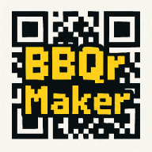

# BBQr Maker

> **ColdCard Q & Wallet Compatibility Bridge Tool** - Convert Bitcoin PSBTs to animated BBQr codes for secure offline transaction signing.

🌐 **Live App:** [bbqr-maker.21baiwan.com](https://bbqr-maker.21baiwan.com)  
📱 **Progressive Web App** - Install for offline use  
🔒 **100% Offline** - No data transmission, complete privacy  

## What is BBQr Maker?

BBQr Maker serves as a crucial bridge between **ColdCard Q hardware wallets** and wallet software that doesn't natively support the BBQr protocol. This tool solves the compatibility gap, enabling users to benefit from modern hardware wallet security while continuing to use their preferred wallet software.

### Primary Use Cases

- 🔗 **Bridge ColdCard Q** with wallets lacking BBQr support (Bitcoin Core, Electrum, Blue Wallet, etc.)
- 🔄 **Enable older wallet software** to work with modern hardware wallets  
- 📱 **Provide animated QR workflow** for wallets with basic QR scanning
- 🔐 **Facilitate secure air-gapped** transaction signing across different wallet ecosystems

## Features

* 📋 **Paste or drop** a Base64-encoded PSBT
* ⚡ **One click conversion** → split to BBQr parts (multi-frame animated QR)
* 🔄 **Auto-plays frames** in a loop for easy hardware wallet scanning
* 🎨 **ColdCard-inspired LCD interface** with authentic retro design
* 💾 **Progressive Web App** - works completely offline after installation
* 🔒 **Zero data transmission** - all processing happens locally
* 📱 **Cross-platform compatibility** - works on desktop and mobile

**No PSBT analysis, no broadcasting, no tracking – just secure QR conversion.**

## Wallet Compatibility

### Hardware Wallets (BBQr Capable)
- ✅ **ColdCard Q** - Primary target device


### Wallet Software (Requires Bridge)
- 🔗 **Bitcoin Core** - Use BBQr Maker for ColdCard Q integration
- 🔗 **Electrum** (older versions) - Bridge to modern hardware wallets
- 🔗 **Blue Wallet** - Enable ColdCard Q compatibility  
- 🔗 **Green Wallet** - Add BBQr workflow support
- 🔗 Most wallets with basic QR scanning capabilities

### Native BBQr Wallet Software  
- ✅ **Sparrow Wallet** - Built-in BBQr support
- ✅ **Specter Desktop** - Modern Bitcoin security tools
- ✅ Other wallets with native BBQr implementation

## Typical Workflow

1. **Your wallet software** creates a PSBT (transaction to sign)
2. **BBQr Maker** converts PSBT to animated BBQr codes
3. **ColdCard Q** scans and signs the transaction securely
4. **Return signed transaction** to your wallet software for broadcasting

## Quick Start

### Use Online (Recommended)
Visit [bbqr-maker.21baiwan.com](https://bbqr-maker.21baiwan.com) and install as PWA for offline use.

### Local Development
```bash
git clone https://github.com/YOUR_USERNAME/bbqr-maker.git
cd bbqr-maker
npm install     # installs only bbqr + qrious + dev tools
npm run build   # generates dist/bbqr-maker.bundle.js
npm run serve   # start local server at http://localhost:8080
```

You can also open `index.html` directly from disk – everything is bundled.

## Security & Privacy

🔒 **Complete Privacy**
- No data transmission - all PSBT processing happens locally in your browser
- No tracking, analytics, or telemetry  
- No external API calls or dependencies after initial load
- Open source and transparent

🛡️ **Security Features**
- Content Security Policy (CSP) headers
- Local font loading for true offline operation
- Service Worker caching for offline functionality
- No sensitive data storage or logging

## Development Scripts

| Command | Purpose |
|---------|---------|
| `npm run build` | Build once with webpack |
| `npm run dev`   | Watch & rebuild on changes |
| `npm run serve` | Simple HTTP server for local testing |

## Project Structure

```
bbqr-maker/
├── src/
│   └── bbqr-maker.js     # Main BBQr conversion logic
├── fonts/                # Local JetBrains Mono fonts  
│   ├── JetBrainsMono-Regular.woff2
│   └── JetBrainsMono-Bold.woff2
├── icon/                 # PWA icons and favicons
├── index.html           # Main UI with ColdCard-inspired design
├── manifest.json        # PWA configuration
├── sw.js               # Service Worker for offline caching
├── webpack.config.js   # Build configuration
└── CNAME              # Custom domain configuration
```

## Technical Details

- **Dependencies:** Only `bbqr` + `qrious` + build tools
- **Bundle size:** Minimal footprint for fast loading
- **Offline-first:** Progressive Web App with service worker caching
- **Font loading:** Local fonts for complete offline functionality
- **Browser support:** Modern browsers with ES6+ support

## Contributing

This project is designed as a bridge tool for wallet compatibility. Contributions welcome for:
- Additional wallet compatibility testing
- UI/UX improvements  
- Performance optimizations
- Documentation improvements

## Repository

**GitHub:** [https://github.com/YOUR_USERNAME/bbqr-maker](https://github.com/YOUR_USERNAME/bbqr-maker)  
**Live Demo:** [bbqr-maker.21baiwan.com](https://bbqr-maker.21baiwan.com)

## License

ISC

---

<div align="center">



**BBQr Maker** - Bridging ColdCard Q with every Bitcoin wallet

*Secure • Offline • Private*

</div>